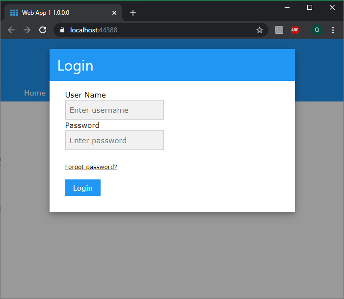
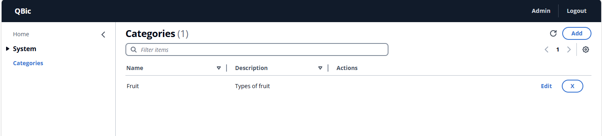
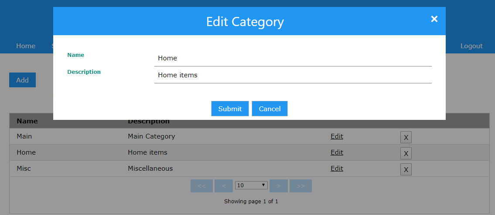

# QBic
A .NET platform for creating Web Servers or CMS systems in .Net  
The front-end, part is dynamically created based on .Net code-configuration.  
This does not rely on blazor, silverlight, web-assembly or any of those frameworks, but uses normal JS, HTML and CSS underneath.  
The easiest way to show what QBic offers, is by showing an [example](#Sample Code).  

# Goal
The goal of this framework/platform is to never have to worry about the front-end, web, code.  
I wasn't very good with JavaScript or HTML when I started this project, and I disliked having to write and debug code in the browser when all I wanted to do was work on the back-end C# code.  
So I created this Framework so I didn't have to repeat same work over and over again.  
Not only did I make this framework create the UI for me, but it also adds a number of commonly used [features](#Features).  

# Introduction
With QBic, you can create admin portals, dashboards, CMS sites, identity servers, and much more.  
All of this while only writing C# code.  
No HTML, JavaScript or CSS.  

# Features
Any **QBic Application** will get all of the following features out of the box, without having to write any extra code:
1. Database synchronization, using NHibernate
2. Auditing
3. User repository
4. Authentication and Authorization
5. Email based account confirmation
6. Email based password reset functionality
7. Role based access control
8. Customizable menu system

# Prerequisites
Before using and running QBic, the following should be installed or adhered to:
1. You have added a Nuget Package Source that contains the QBic platform binaries.  
2. You have IIS installed on your development machine.  
3. You run Visual Studio as an administrator when working on QBic projects.
4. Add HTTPS binding to IIS for **Default Site**.
5. Install [URL REWRITE](https://www.iis.net/downloads/microsoft/url-rewrite) module into IIS.  

# Creating a new QBic Project
You can either choose to setup a new QBic project manually, or using my custom Visual Studio Project Template ($10).

## Creating a project Manually
1. Create a new Visual Studio ASP.Net Web Application (.NET Framework)
1. Make sure to choose .NET 4.6.1 or greater
1. Choose an Empty Web Application
1. Install the WebsiteTemplateCore nuget package 
1. Create a new class that inherits from **ApplicationStartup**
1. Implement the mandatory functions and create the constructor required by **ApplicationStartup** parent class  
   The **SetupDefaults** is a good place to create your default, or admin, user  
   This is actually required, else you will not be able to log into your application when it starts for the first time  
   The Test project's [Startup](WebsiteTemplate.Test/Startup.cs) file can be used to see a basic example of adding an admin/first user
1. Add a class that inherits from **ApplicationSettingsCore**  
   I usually call this file **AppSettings**, but it can be anything
1. Implement the mandatory properties and methods of the **ApplicationSettingsCore** class  
   **GetApplicationStartupType** should return the type of class you created in step #5
1. Set the override field **UpdateDatabase** to **true**  
   This will create the database and tables, and can be set to false once you have your database set up and read
1. Next, you need to register **Unity** in the web.config file, which is used for DependencyInjection  
   This is done by adding the following into the web.config file, beneath the **configuration** element  
   
   ```html
   <configSections>
      <section name="unity" type="Microsoft.Practices.Unity.Configuration.UnityConfigurationSection, Unity.Configuration" />
   </configSections>
   ```
   
1. The Application Settings file should also be registered in the web.config file.  
   This is done by adding a **<unity>** section beneath **configuration**, similar to the following example:  
   
   ```html
   <unity xmlns="http://schemas.microsoft.com/practices/2010/unity">
     <alias alias="ApplicationSettingsCore" type="WebsiteTemplate.Utilities.ApplicationSettingsCore,  WebsiteTemplate.Utilities" />
     <namespace name="WebsiteTemplate.Utilities" />
     <assembly name="WebsiteTemplate" />
     <container>
	   <!--Register your specific ApplicationSettingsCore file here-->
       <register type="ApplicationSettingsCore" mapTo="WebApplication1.Settings.AppSettings, WebApplication1" />
     </container>
   </unity>
   ```  
   
   Make sure to update the name of your application settings class and namespace in the html example provided.
1. Add connection string value to the web.config file as well  
   This can be done by adding the following right below the previous unity section (without any changes required):  
   
   ```html
   <connectionStrings>
     <add name="MainDataStore" connectionString="Data Source=##CurrentDirectory##\Data\appData.db;Version=3;Journal Mode=Off;Connection Timeout=12000" />
     <add name="AuditDataStore" connectionString="Data Source=##CurrentDirectory##\Data\auditData.db;Version=3;Journal Mode=Off;Connection Timeout=12000" />
   </connectionStrings>
   ```  
   
1. Create a new folder (for you sqlite database) in your project called **Data**  
    If you have modified the connection string values from this example, you may need to specify a different folder
1. Create a new file called "siteOverrides.css" in **FrontEnd/css**  
   You can populate it as follows to start with:  
   
   ```css
   .w3-app-color, .w3-hover-app-color {
   	color: #fff !important;
   	background-color: #2196F3 !important;
   }
   .w3-hover-app-color {
   	-webkit-transition: background-color .3s,color .15s,box-shadow .3s,opacity 0.3s;
   	transition: background-color .3s,color .15s,box-shadow .3s,opacity 0.3s;
   }
   ```  
1. You should now be ready to run the application  
   It might take a couple of minutes (but not more than 5) to run the first time as it sets up the database  
   But eventually you should be presented with a login screen if you have followed all the steps correctly, as follows:  
   
	
## Using the Custom QBic Project Template
**Coming Soon**  
The QBic project template will have a once-off fee of $10, to help me maintain the template and this repo

# Documentation
Documentation will be added over the course of time.  

But, for the time being, there will be a **QBicSamples** repository with examples of how to use the QBic platform. Link to be added soon.

# Sample Code
Consider the following code.  
This is all the code required to build view, add, edit and delete (CRUD) functionality for a **Category** class.  
```c#
public class CategoryCrudItem : BasicCrudMenuItem<Category>
{
    public CategoryCrudItem()
    {
    }

    public override bool AllowInMenu => true;

    public override string GetBaseItemName()
    {
        return "Category";
    }

    public override EventNumber GetBaseMenuId()
    {
        return 6530;
    }

    public override Dictionary<string, string> GetColumnsToShowInView()
    {
        var res = new Dictionary<string, string>();
        res.Add("Name", "Name");
        res.Add("Description", "Description");
        return res;
    }

    public override Dictionary<string, string> GetInputProperties()
    {
        var res = new Dictionary<string, string>();
        res.Add("Name", "Name");
        res.Add("Description", "Description");
        return res;
    }
}    
```
And below is the view and the input screen this code generates:  



