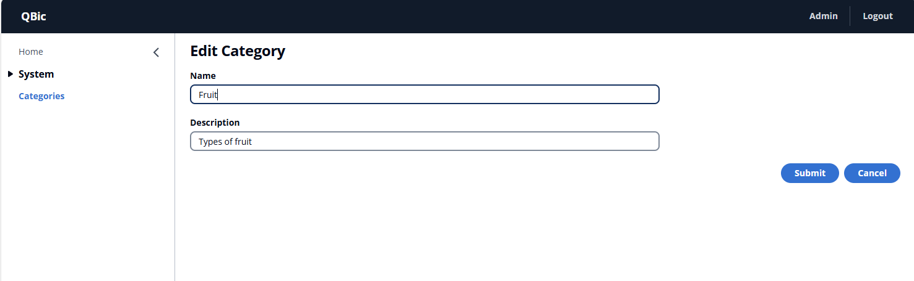

[](https://github.com/quintonn/QBic/actions/workflows/github-actions.yml)  


##### Table of Contents  
1. [Introduction](#introduction)  
1. [Goal](#goal)  
1. [Features](#features)  
1. [Prerequisites](#prerequisites)  
1. [Creating a new qBic Project](#creating-a-new-qBic-project)  
1. [Documentation](#documentation)
1. [Sample Code](#sample-code)
1. [Known Problems](#known-problems)  
8.1 [SQLite.Interop.dll](#sqLiteinteropdll)  
8.2 [Unable to delete SQLite dll](#unable-to-delete-sqLite-dll)  
1. [Projects using qBic](#projects-using-qBic)

# Introduction
A platform for creating Web Servers, back-end solutions, CRM or CMS systems in .Net 5  
qBic is powered by code-driven configuration. The entire application is built using C# code.  
The easiest way to demonstrate what qBic offers, is by showing [an example](#sample-code).  

With qBic, you can create admin portals, dashboards, CMS sites, identity servers, and much more.  
All of this while only writing .Net code.  
No HTML, JavaScript or CSS.  
A lot of the **magic** is driven by abstract classes and inheritance.                   

# Goal
The goal of this framework/platform is to never have to worry about the front-end, web, code.  
I wasn't very good with JavaScript or HTML when I started this project, and I disliked having to write and debug code in the browser when all I wanted to do was work on the back-end C# code.  
So I created this Framework so I didn't have to repeat the same work over and over again.  
Not only did I make this framework create the UI for me, but it also adds a number of commonly used [features](#Features).  

One of my main goals was to allow **a single developer** to build a relatively large and complex system.  
And I believe qBic has achieved that.

# Features
Any **qBic Application** will get all of the following features out of the box, without having to write any extra code:
1. Database synchronization, using NHibernate
2. Auditing
3. User repository
4. Authentication and Authorization
5. Email based account confirmation
6. Email based password reset functionality
7. Role based access control
8. Customizable menu system

# Prerequisites
Before using and running qBic, the following should be installed or adhered to:
1. You have .net 5 installed on your development machine.  
2. You run Visual Studio as an administrator when working on qBic projects.

# Creating a new qBic Project
To create and run a new project, simply run the following commands:  
1. dotnet new -i qbic-dotnet-template
1. dotnet new qBic -n myProject  
1. cd myProject  
1. dotnet run 
1. Visit https://localhost:5001
1. It might take a few seconds before the website is ready, so maybe refresh the web page  
1. Login with admin/password

Or, if on Windows, run the following single line:
> dotnet new -i qbic-dotnet-template && dotnet new qBic -n myProject && cd myProject && start "" "https://localhost:5001" && dotnet run

# Documentation
Documentation will be added over the course of time.  

But, for the time being, there is a [qBic Samples](https://github.com/quintonn/qBicSamples) repository with examples of using the qBic platform. 

# Sample Code
Consider the following code.  
This is all the code required to create basic CRUD functionality for a **Category** class, including the view and input screens and **all** the logic to actually view, create, edit and delete a category.  
```c#
public class CategoryCrudItem : BasicCrudMenuItem<Category>
{
    public CategoryCrudItem()
    {
    }

    public override bool AllowInMenu => true;

    public override string GetBaseItemName()
    {
        return "Category";
    }

    public override EventNumber GetBaseMenuId()
    {
        return 6530; // An internal number to uniquely identify this activity/event
    }

    public override Dictionary<string, string> GetColumnsToShowInView()
    {
        var res = new Dictionary<string, string>();
        res.Add("Name", "Name");
        res.Add("Description", "Description");
        return res;
    }

    public override Dictionary<string, string> GetInputProperties()
    {
        var res = new Dictionary<string, string>();
        res.Add("Name", "Name");
        res.Add("Description", "Description");
        return res;
    }
}    
```
And below is the view and the input screen this code generates:  
### Screen View
  
### Input Screen


# Known Problems
### SQLite.Interop.dll
Sometimes you might see this error when you try and run your qBic application while using SQLite 
> Unable to load DLL 'SQLite.Interop.dll': The specified module could not be found  

There are many reasons for seeing this error and we have made many efforts to fix them, but some reasons still persist:
1. The **Identity** of the **AppPool** in **IIS** that runs the qBic website does not have access to the location the project was created in.  

   This might be happen if the **AppPool** is **DefaultAppPool** and the **Identity** is **NetworkService** and the project is created inside the **C:\Users\XXXX\source\repos** folder which are the defaults for Visual Studio and IIS.  

   The easiest fix for this is to create or move the project into a different location (e.g. c:\MyProjects\).  
   Another solution might be to change the **Identity** of the appPool, or give it access to the source\repos folder.  
1. On Raspberry pi, and possibly other linux distributions, the SQLite binaries need to be compiled and some of the output copied into the root folder to be able to use SQLite.  
   The exact folder to copy the files into will depend on where the **dotnet run** command is executed from.  
   Instructions for doing this can be found here: http://blog.wezeku.com/2016/10/09/using-system-data-sqlite-under-linux-and-mono/

### Unable to delete SQLite dll
When using SQLite (instead of MS-SQL) you might see an error when building your applicatio that the SQLite dll could not be removed.  
As mentioned above, many steps have been taken to eliminate this error, but it might still ocurr from time to time.  

The simplest solution for this has been to run the following command in an elevated command prompt:  
> iisreset

# Projects using qBic
Some projects that have used, or are using, qBic are listed below.  
Feel free to add your project too:  
1. The back-end for a custom mobile application for Bargain Books in South Africa  
   *This has been discontinued*
2. [Repo Castle](https://repocastle.com/)  
   A private NuGet repository with fine-grained access control
3. The [qBic Samples](https://github.com/quintonn/qBicSamples) application  
   This project shows example of features of qBic
4. A custom school CMS.  
   The system keeps track of studendts' attendance & grades, and also generate and prints report cards.  
   
